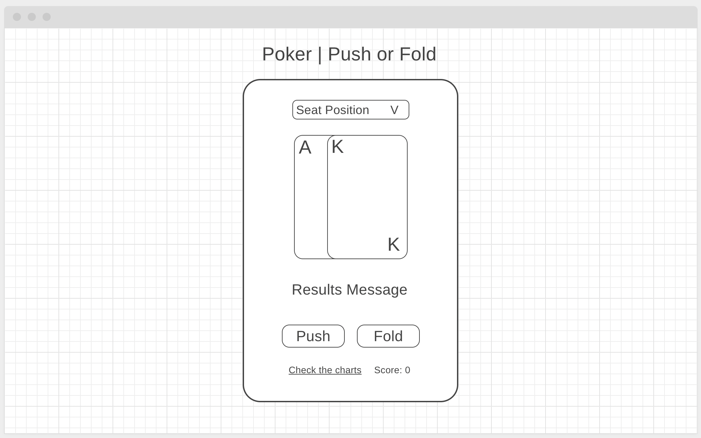
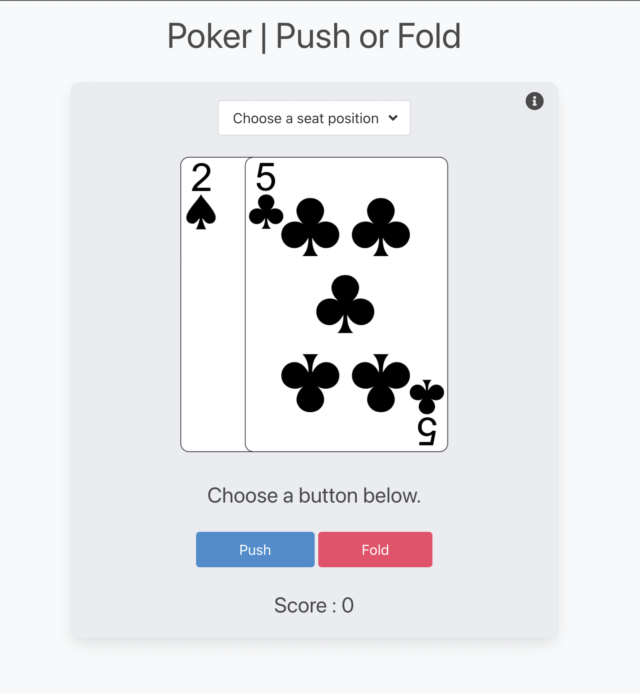
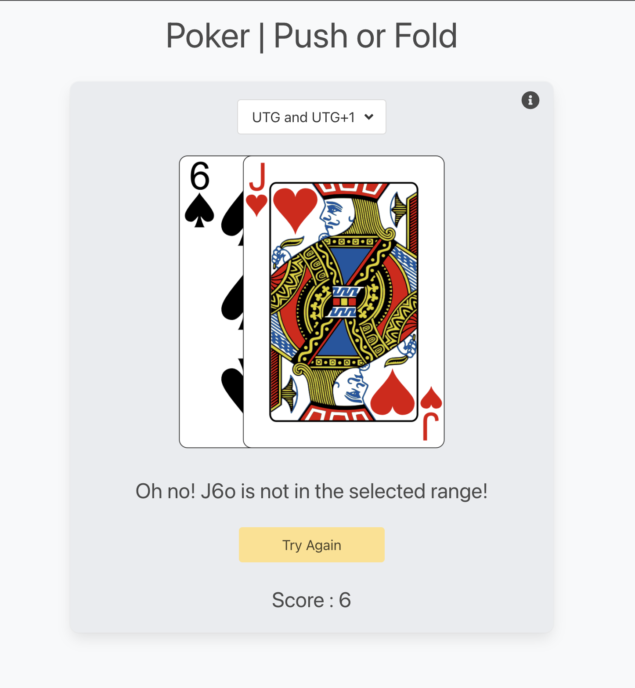
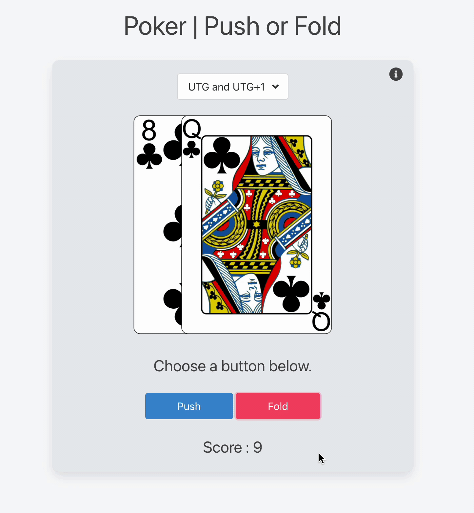

# Poker | Push or Fold Memory Game

If you play enough poker tournaments, you will find yourself in a “short-stack” situation where your tournament life is on the line. In these scenarios, the most profitable way to play is to use the Push/Fold system. Simply put, if you have a good hand before the flop (any community cards come out) you put all your chips in for a chance to double up - if you lose the hand you're out of the tournament.

Poker pros memorize [charts](https://upswingpoker.com/push-fold-tournament-strategy-charts/) that tell them what they should do when put in a Push/Fold situation. This game will help you test your memorization of these charts by presenting you with a random poker hand and giving you the chance to push or fold your <b>10 big blind</b> chip stack. If you get 10 hands in a row correct you will gain poker pro status and win the tournament! If you get even 1 hand wrong you will lose the game.

## Getting Started:

[This link will take you to the deployed game.](https://elated-carson-819d6b.netlify.app/) You can begin the game by selecting a seat position from the dropdown menu then pressing either the Push or the Fold button. If you press a button before selecting a seat you will be given the default seat of "UTG and UTG+1."

## Screenshots:

Here are a few screenshots of gameplay:

Original wireframe concept

Main Screen

Losing Screen

Winning Screen

## Technologies Used:

1. HTML
2. CSS
3. JavaScript
4. Bulma
5. Animate.css
6. canvas-confetti
7. Netlify
8. CI/CD

## Next Steps:

This application could be used to test the user's knowledge of any poker chart, not just Push/Fold charts. In future updates I'd like to add other chart sets and more user inputs to account for new poker scenarios.

I plan to add the ability for the user to mute the game audio and choose a light or dark mode.
